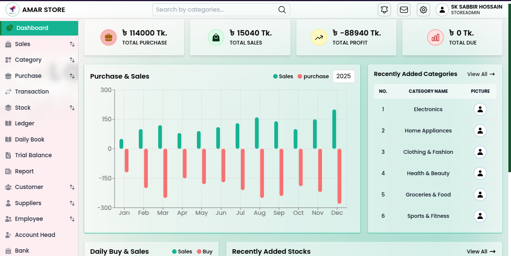

# Business-IMS

**Business-IMS** is an open-source inventory management system built with Next.js 15, Express.js, and MongoDB, designed to help businesses efficiently track stock, sales, purchases, and returns. Whether you're a developer looking to contribute or a business owner seeking an effective inventory solution, this README will guide you through the essential details of the project.



## Table of Contents

- [Business-IMS](#business-ims)
  - [Table of Contents](#table-of-contents)
  - [Features](#features)
      - [User Authentication](#user-authentication)
      - [Role-Based Access Control (RBAC)](#role-based-access-control-rbac)
      - [Superadmin Dashboard](#superadmin-dashboard)
      - [Store Management](#store-management)
      - [Stock Management](#stock-management)
      - [Sales \& Returns](#sales--returns)
      - [Purchase Management](#purchase-management)
      - [Advanced Analytics](#advanced-analytics)
    - [Future Enhancements](#future-enhancements)
  - [Technologies Used](#technologies-used)
  - [Installation](#installation)
      - [1. Clone this repository to your local machine using Git.](#1-clone-this-repository-to-your-local-machine-using-git)
      - [2. Change to the project directory.](#2-change-to-the-project-directory)
      - [3. Install dependencies. (recommended to use yarn)](#3-install-dependencies-recommended-to-use-yarn)
      - [4. Set up environment variables](#4-set-up-environment-variables)
      - [5. Start the development server using this command:](#5-start-the-development-server-using-this-command)
    - [Usage](#usage)
  - [Contributing](#contributing)
  - [License](#license)
    - [Summary of Terms:](#summary-of-terms)
  - [Code of Conduct](#code-of-conduct)
  - [Contact](#contact)

## Features

**Business-IMS** includes the following features:

#### User Authentication

- Secure account creation and login with **NextAuth**.
- Supports OAuth and credential-based authentication.

#### Role-Based Access Control (RBAC)

- Restrict access and permissions based on user roles (Superadmin, Store Admin, Manager, Staff, etc.).
- Ensure users only access the features relevant to their roles.

#### Superadmin Dashboard

- **Superadmin** can create, update, and delete multiple stores.
- Manage multiple stores efficiently from a centralized panel.

#### Store Management

- Each store has its own **Store Admin**.
- **Store Admin** can manage their own stock, purchases, sales, return sales, suppliers, customers, and employees.

#### Stock Management

- Add, update, and delete stock items with real-time updates.
- Maintain accurate stock levels and inventory tracking.

#### Sales & Returns

- Record sales transactions and generate invoices.
- Manage return processes efficiently with refund tracking.

#### Purchase Management

- Track supplier purchases and maintain purchase records.
- Keep a detailed history of all purchases for better decision-making.

#### Advanced Analytics

- Automatically calculate **total purchases, profit, and costs**.
- Generate insightful reports for business growth and decision-making.

### Future Enhancements

- **Barcode Scanning** for quicker stock management.
- **AI-Powered Insights** for advanced data analysis.

## Technologies Used

- **Next.js 15:** A React framework for building server-rendered or statically-exported React applications.
- **Authentication**: Utilizes `next-auth` version 5 for authentication.
- **React:** A popular JavaScript library for building user interfaces.
- **Tailwind CSS:** A utility-first CSS framework for styling the user interface.
- **Backend:** Node.js, Express.js used for building the REST API.
- **Database**: Database schema for MongoDB using Mongoose models,

## Installation

To get started with Daily Blogs, follow these steps:

#### 1. Clone this repository to your local machine using Git.

```bash
https://github.com/sksabbirhossain/business-ims.git
```

#### 2. Change to the project directory.

```bash
cd business-ims
```

#### 3. Install dependencies. (recommended to use yarn)

```bash
yarn install
```

#### 4. Set up environment variables

Create a .env file in the root directory of the project. You can use the .env.example file as a template. Copy the example file and rename it to .env

```bash
cp .env.example .env
```

#### 5. Start the development server using this command:

```bash
yarn run dev
```

Access the application in your web browser at [http://localhost:3000](http://localhost:3000).

### Usage

- Visit the deployed website or run the development server (as described in the installation instructions) to access the application.

## Contributing

If you have any suggestions on how to improve this Application, please open an issue, share your ideas, and create a pull request. Or read this [CONTRIBUTING](CONTRIBUTING.md) file.

## License

This project is licensed under the terms outlined in the [LICENSE](LICENSE.md) file.

### Summary of Terms:

- **Viewing and Studying**: You are free to view, study, and learn from the source code and documentation.
- **Contributing**: Contributions to this project are welcome. Please adhere to the contribution guidelines provided in the [CONTRIBUTING.md](CONTRIBUTING.md) file.
- **Restrictions**:
  - **Personal Use**: This project cannot be used for personal purposes outside the scope of this open-source project.
  - **Commercial Use**: You are not allowed to sell, distribute, or incorporate any part of this project into other commercial products or services.

**Violation of License Terms**: If any part of this project is copied, used, or distributed in violation of these terms, legal action may be taken to enforce these license terms.

By using this project, you agree to abide by these terms. For more details, please refer to the full [LICENSE.md](LICENSE.md) file.

## Code of Conduct

We adhere to the Contributor Covenant Code of Conduct to ensure a positive and inclusive environment for all participants in our community. Please review the full [Code of Conduct](CODE_OF_CONDUCT.md) for details on our standards and enforcement guidelines.

For more details, visit the [Code of Conduct](CODE_OF_CONDUCT.md) file.

## Contact

For any questions, feedback, or inquiries, you can reach out through the following:

- **GitHub Issues**: [Submit an issue](https://github.com/sksabbirhossain/business-ims/issues)
- **GitHub Profile**: [sksabbirhossain](https://github.com/sksabbirhossain)
- **Linkedin Profile**: [sk-sabbir-hossain](https://www.linkedin.com/in/sk-sabbir-hossain/)
- **Facebook Profile**: [sksabbirhossain4](https://www.facebook.com/sksabbirhossain4)

Feel free to contact me if you have any questions or if you would like to contribute to the project!

Enjoy using **business-ims!** If you have any questions or encounter any issues, please create an issue or contact me.
